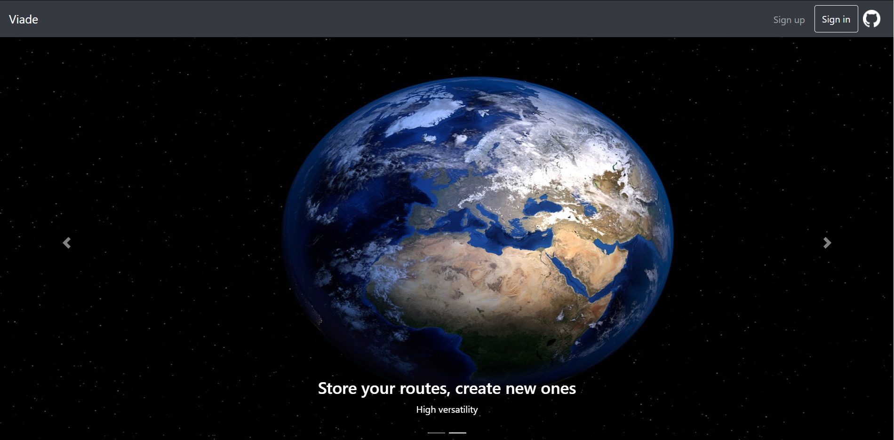
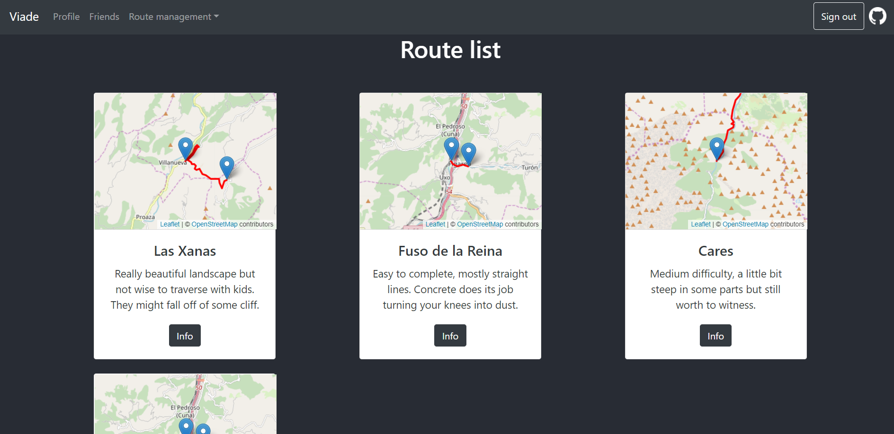

# VIADE EN3A

Viade is an Application whose task is to manage routes.

    

It allows you to store your favourite scenic routes on your [Solid Pod](https://solid.inrupt.com/how-it-works) and to share it with your friends and family.

    

## Miscelaneous Information

This project is an assignment for the [Software Architecture course](https://arquisoft.github.io/) following [these requirements](https://labra.solid.community/public/SoftwareArchitecture/AssignmentDescription/).

The app is deployed at [https://arquisoft.github.io/viade_en3a/](https://arquisoft.github.io/viade_en3a/) which also contains a [technical documentation](https://arquisoft.github.io/viade_en3a/docs).

More information about how this project has been setup is available [in the wiki](https://github.com/Arquisoft/viade_en3a/wiki).

## Developer names

  * Jesús Quesada Matilla - [jesQM](https://github.com/jesQM)
  * Daniel Finca Martínez - [fincamd](https://github.com/fincamd)
  * Nicolás Mencía Gómez - [nicomencia](https://github.com/nicomencia)
  * Óscar Sánchez Campo - [oscar134](https://github.com/oscar134)
  * Diego Ramírez Amandi - [Drastur](https://github.com/Drastur)
  * Pablo Fernandez Martínez - [PabloFerMar](https://github.com/PabloFerMar)
