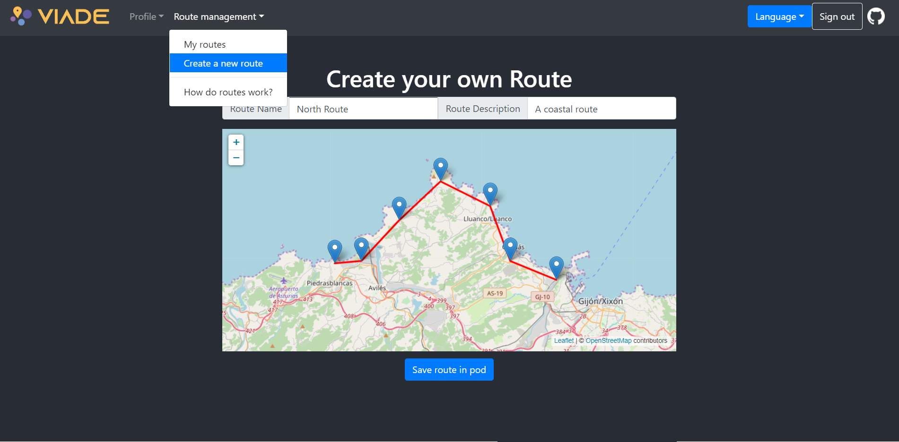
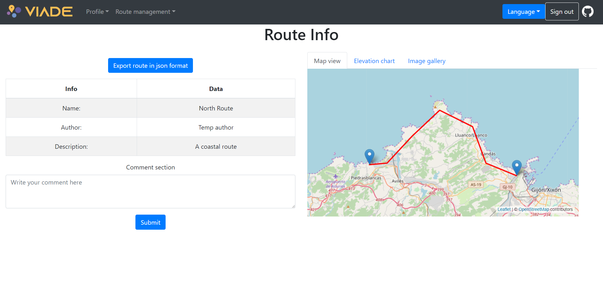
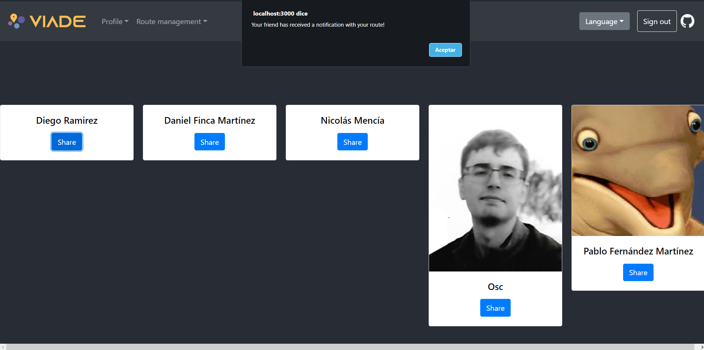

# VIADE EN3A

## Index
1. Index
1. Introduction
1. To Start
    1. Create a POD
    1. Login
    1. Create a route
    1. View a route
    
1. Miscellaneous Information
1. Developers Names

## Introduction

Viade is an Application whose task is to manage routes.

    

It allows you to store your favourite scenic routes on your [Solid Pod](https://solid.inrupt.com/how-it-works) and to share it with your friends and family as well as comment on those of your friends'.

    

## To Start
### Create a POD

If you are not an owner of a POD you can create one by pressing the register button.
This will redirect you to a provider, where you can create your POD.

### Login

Once the POD is created, press the login button and a popup will ask you for credentials.
Once logged in you will have access to new options.

### Create a route

From "Route Management > Create a new Route" you can create a new route.
Just set a title, description, select the waypoints of the route and press "Save route in POD".

    

### View a route

We can now navigate to "Route Management > My Routes", where the routes you have created are listed.
When clicking on "Info" of the new route a new window will display all the information recorded, as well as comments posted and a elevation chart of the waypoints.

    

### Share with friends

When displaying all routes "Route Management > My Routes", you can click on the share option.
This will list all friends and when clicking share, a message with the route will be sent to the inbox of your friend.

    

## Miscellaneous Information

This project is an assignment for the [Software Architecture course](https://arquisoft.github.io/) following [these requirements](https://labra.solid.community/public/SoftwareArchitecture/AssignmentDescription/).

The app is deployed at [https://arquisoft.github.io/viade_en3a/](https://arquisoft.github.io/viade_en3a/) which also contains a [technical documentation](https://arquisoft.github.io/viade_en3a/docs).

More information about how this project has been setup is available [in the wiki](https://github.com/Arquisoft/viade_en3a/wiki).

## Developers names
* Jesús Quesada Matilla - [jesQM](https://github.com/jesQM)
* Daniel Finca Martínez - [fincamd](https://github.com/fincamd)
* Nicolás Mencía Gómez - [nicomencia](https://github.com/nicomencia)
* Óscar Sánchez Campo - [oscar134](https://github.com/oscar134)
* Diego Ramírez Amandi - [Drastur](https://github.com/Drastur)
* Pablo Fernandez Martínez - [PabloFerMar](https://github.com/PabloFerMar)
