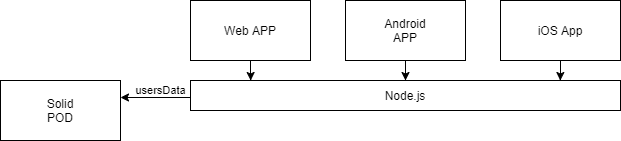

[[section-deployment-view]]

== Deployment View

Viade is multiplatform, so in the following lines we will show the physical architecture that our app will run over.

=== Infrastructure Level 1

.Legend
[cols="1,4"]
|===
| *Part* | *Explanation*

| Mobile Applications
| Android and iOS Applications will be generated and will run over such devices.

| Web Applications
| Main browsers will be able to run the application.

| Node.js
| Will be the runtime environment executing the javaScript code as server-side (not client-side).

| Solid PODs
| Will store the users information (their routes)
|===

Motivation::

It is a constraint that we must use Node.js, Solid PODs and be multiplatform so this structure is the result of that.

Quality and/or Performance Features::

_<explanation in text form>_

Mapping of Building Blocks to Infrastructure::
_<description of the mapping>_

=== Infrastructure Level 2

[role="arc42help"]
****
Here you can include the internal structure of (some) infrastructure elements from level 1.

Please copy the structure from level 1 for each selected element.
****

==== _<Infrastructure Element 1>_

_<diagram + explanation>_

==== _<Infrastructure Element 2>_

_<diagram + explanation>_

...

==== _<Infrastructure Element n>_

_<diagram + explanation>_
