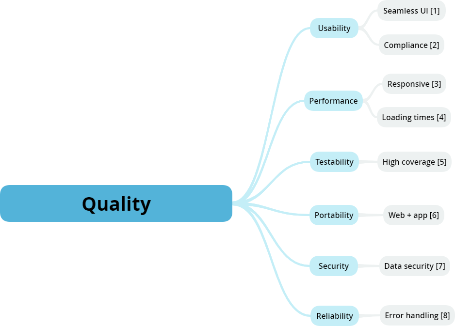

[[section-quality-scenarios]]
== Quality Requirements

****
In this section we expand and go into more detail in our quality goals, already defined in the 1st section of our documentation.
****

=== Quality Tree

Here our quality tree is represented, showing the most important quality goals beside their requirements.
Their are prioritized from I to III, being I the highest and III the lowest. 

=== Quality Scenarios

|===
|*Ref*|*Quality Attribute*|*Quality Scenario*|*Priority*
|1|Usability - Seamless UI|UI is easy and intuitive to use, no need of a guide for any user to understand it|HIGH
|2|Usability - Compliance|UI complies with EU internet accessibility standards|HIGH
|3|Performance - Responsive|User interaction must be reflected at the moment|HIGH
|4|Performance - Loading times|Loading times don't have to be a bother to the user|HIGH
|5|Testability - Fully tested UI|Every aspect of the app must be tested extensively|HIGH
|6|Quality - Code quality|The code has to maintain a quality level expeted from a software engineer|MEDIUM
|7|Portability - Platforms|The app must be available both in the navigator and in a mobile device|MEDIUM
|8|Security - Data control|Users must have complete control over their data flow|LOW
|9|Security - Data security|Unauthorized user access must be reported|LOW
|10|Reliability - Error handling|Small errors shouldn't result in a system crash, fatal errors must be minimized|LOW
|===

****
